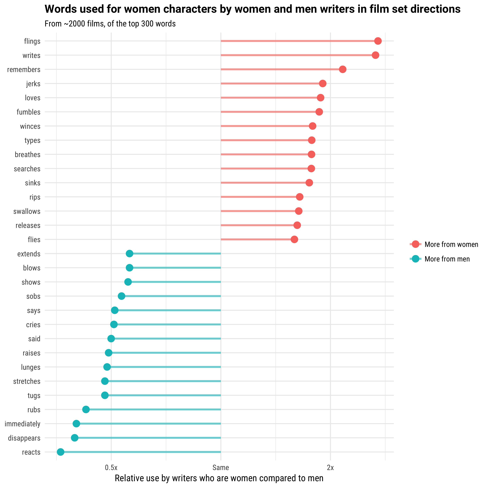

How are women portrayed in film? It's complicated; that question might make you think of a male protagonist's romantic interest, a damsel in distress who needs to be rescued, or maybe Wonder Woman.

One way to quantitatively measure how women are portrayed in film is to look at scene directions in film scripts. Scene directions are the part of a script that are not dialogue, describing what's happening on screen and telling actors how to move and how to deliver their lines. These scene directions communicate to the actors, producers, and director what story the script is working to tell. 

In this analysis, we used text mining to identify words that are paired with the pronouns "he" and "she" in scene directions for over 2000 film scripts for movies released from the 1930s to today. We then analyzed which words are more likely to come after one compared to the other. Which words are most likely to be used with "she" in film script scene directions compared to those used with "he"? 

There are dramatic differences in the kinds of words we see here. In movies, women are more likely to snuggle, giggle, squeal, and sob while men are more likely to gallop, shoot, howl, and kill. We see evidence here of the tropes and storytelling conventions that propel so many films, and how men, women, and their relationships are often portrayed.

Now let's look at the top 800 words, including those that are used about evenly after "he" and "she".

*Really rough mock-up of general idea for main viz:*

*Label all the outlier points, choose interesting other points to label. For all labeled points, have example text for interactive hover. For non-labeled points, show word on hover.*

## Impact of writers

*Rough mockup for viz of writer viz*

Hollywood can be a tough place to work as a creative woman, either writing, directing, or producing films. We can use our text mining approach to explore the impact that the gender of a writer has on how characters are portrayed. We used IMDB biographies, pictures, and names to manually classify the genders of writers for our film script dataset. 

Gender can be a complicated identification for people, but English has two singular third person pronouns most often used for people, "he" and "she". In this analysis, for both the text data and the identification of gender for film writers, we have chosen to identify men and women with the pronouns "he" and "she". Using this type of classification, a transgender woman (either a writer or a character in a script) described with the pronoun "she" would be classified as a woman.

Using this connection to who wrote these scripts, we can examine how writers who are men and women are portraying women in film. Do women writers portray women differently? How would the overall cultural representation of women be different if there were more women writing the movies we watch?

In our dataset, about 15% of film writers are women and about 85% are men. If women were more equitably represented in the ranks of Hollywood writers, our analysis indicates we would see fewer women in movies disappearing, reacting, and sobbing and more women loving, writing, and searching. And flinging things around, apparently!

This plot shows one way to look at differences between writers who are men and women. Let's look a little deeper, though, to learn more. For example, do some of these differences hold true no matter what kind of character a women is writing? What is the interaction between *writers* who are men and women and *characters* who are men and women?

*Hover for word for all points*

The size of the circle in this plot shows how often that word is used overall in film scripts; a word like "smiles" is used more often and a word like "understands" is used less often. Words close to an axis are used about the same with "he" and "she" for that kind of writer, and words far away from an axis exhibit more dramatic differences.

There are some words that writers who are men and women are more likely to use, no matter what kind of character they are writing. In the upper right quadrant, we find the words that writers who are women are more likely to use. Writers who are women are more likely to write characters who sing, love, shift, sink into things, and burst into places. And lots of flinging! The lower left quadrant shows the words that writers who are men are more likely to use, for both male and female characters. Writers who are men are more likely to write characters who react, clutch, dive, shout, and emerge from places.

In the other quadrants, we can see remarkable differences in how writers who are men and women portray characters who are men and women. If you look in the upper left quadrant, we find words that writers use in describing characters of the opposite gender. There are some romantic and sexual words here, like "kiss", "gaze", and "stroke", as well as words that imply, well, less happy outcomes, such as "disappears" and "died". The lower right quadrant shows us the words that writers use to portray characters the same gender as them. These characters wince, jerk, fumble, and perhaps most remarkably, write on screen. There are verbs here that are active but less explicitly testosterone-fueled than the lower left quadrant; writers of the same gender create characters who crawl, climb, play, and scan. These characters also hear and understand. A woman in a movie doing such things is a far cry from the giggling, squealing, blushing character we met at the beginning of this essay.

