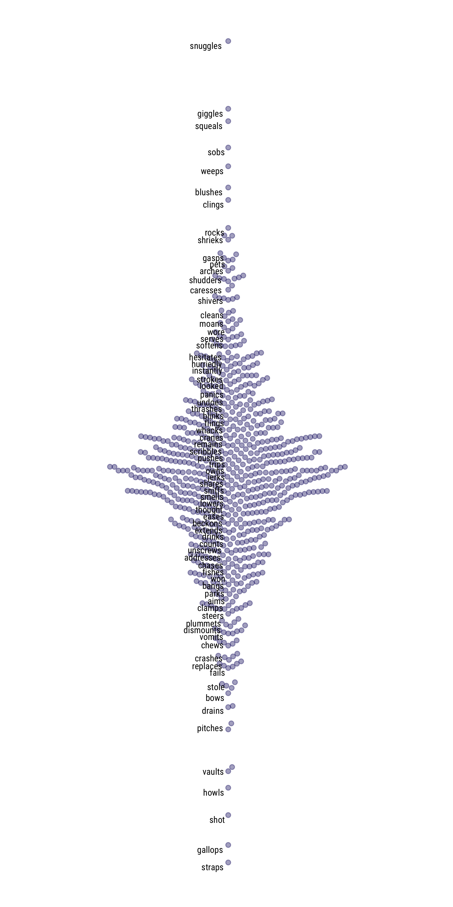

In April 2016, we [broke down](https://pudding.cool/2017/03/film-dialogue/) film dialogue by gender. The essay presented an imbalance in which men delivered more lines than women across 2,000 screenplays. But quantity of lines is only part of the story. What characters do matters, too.

Gender tropes (e.g., [women are pretty/men act, men don’t cry](http://tvtropes.org/pmwiki/pmwiki.php/Main/MenAreStrongWomenArePretty)) are just as important as dialogue in understanding how men and women are portrayed on-screen. These stereotypes result from many components, including casting, acting, directing, etc.

The film script, arguably, is ground zero—the source material by which everyone is influenced. And in film scripts, there’s dialogue and screen direction. For example, let’s take this iconic scene from Titanic:

> compare dialogue/set directions here

The curious data here is less what Rose says (“I’m flying”) and more what the screen direction prescribes (“she smiles dreamily,” “he pushes against her”). In the following analysis, we go deep on screen direction to understand gender tropes. **We examined 2,000 scripts and broke down every screen direction mapped to the pronouns “he” and “she.”** 

These are the most extreme examples. There is a high likelihood that women will snuggle, giggle, squeal, and sob, relative to men. Conversely, men are more likely to strap, gallop, shoot, howl, and kill.

Let’s now examine the 800 most commonly used pronoun pairs in screen direction.

*Really rough mock-up of general idea for main viz:*

*Label all the outlier points, choose interesting other points to label. For all labeled points, have example text for interactive hover. For non-labeled points, show word on hover.*

## Impact of writers

Next, let’s examine how the writer’s gender affects characters’ behavior. Do women writers use different language for women roles? What are the words that both male and female writers use about equally when describing characters? Would results change dramatically if there were more women writers? First, we will narrow the data set to the most commonly used 400 words.

*Rough mockup for viz of writer viz*

*Hover for word for all points*

There are some directions where the writer’s gender makes no difference. Relative to men, women gasp, hurry, smile, hesitate, and stir (mostly while cooking), regardless of whether the writer is a man or a woman. Men are consistently more likely to smash things, draw their weapons, grin, wink, point, talk, and speak.

When describing the opposite gender, both men and women use some overtly romantic and sexual words, such as “kiss” and “stroke,” as well as more subtle words including “respond” and “embrace.”

But there are differences. In our data set, 15% of film writers were women; 85% were men. Should Hollywood reach gender parity, we’d expect fewer women characters to respond, kiss, and cry. The increase in female writers would also mean women would be more likely to spy, find things, and, perhaps most remarkably, write on-screen.

> The code used in analysis is [publicly available on GitHub](https://github.com/juliasilge/women-in-film). The data set for this analysis included 1,966 scripts for films released between 1929 and 2015; most are from 1990 and after. Each script was processed to extract only the set directions, excluding dialogue from this analysis. We then identified all [bigrams in these scripts that had either “he” or “she” as the first word in the bigram](https://juliasilge.com/blog/gender-pronouns).

> Then, we calculated a log odds ratio to find words that exhibit the biggest differences between relative use for “she” and “he”. We removed stop words and did some other minimal text cleaning to maintain meaningful results. We calculated the overall log odds ratio for the 800 most commonly used words, and then log odds ratios for only scripts with male writers and female writers for the 400 most commonly used words. Scripts often have more than one writer and could be counted in both categories. To learn more about text mining analyses like this one and how to perform them, [check out Julia’s book](http://tidytextmining.com). 

> Writers’ gender was determined via IMDB biographies, pictures, and names.

> English has two singular third-person pronouns most often used for people, “he” and “she.” In this analysis, for both the text data and the identification of gender for film writers, we have chosen to identify men and women with the pronouns “he” and “she.” Using this type of classification, any writer or character associated with the pronoun “she” is classified as a woman.

